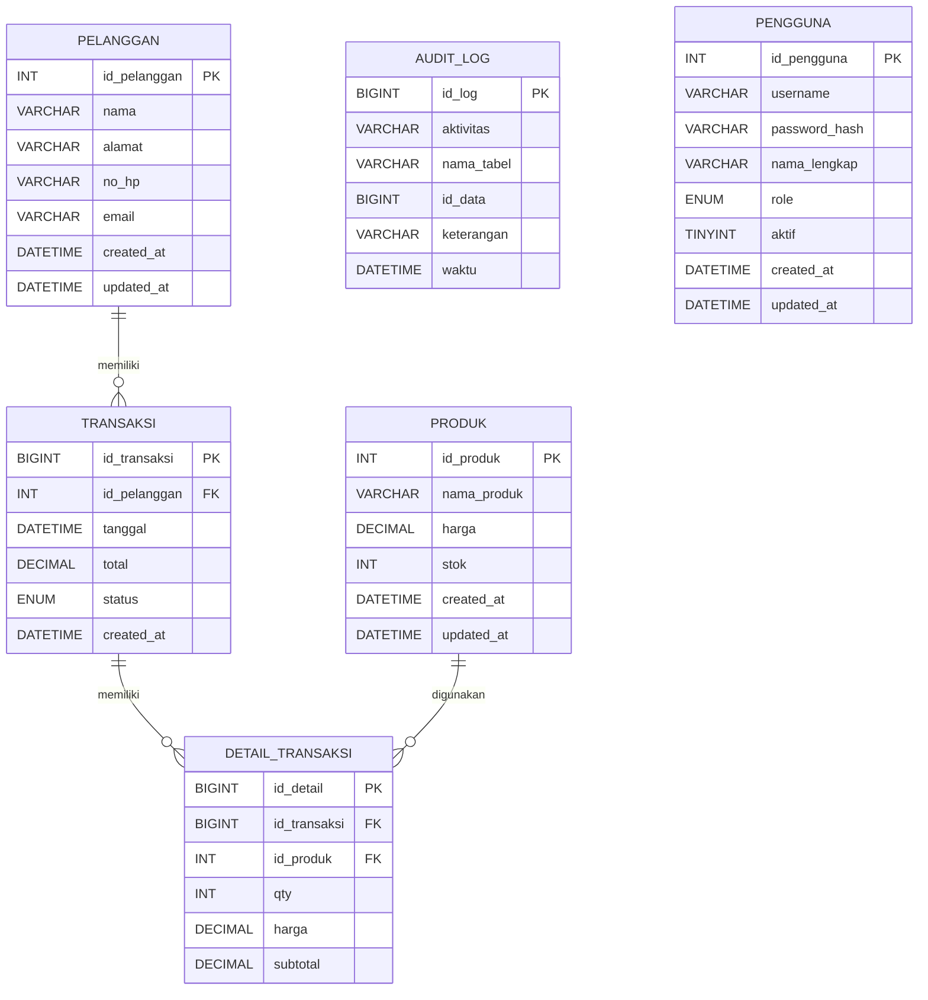

# ERD — Aplikasi Pengelolaan Data Penjualan

Catatan:
- `audit_log` mencatat perubahan pada `produk` melalui trigger.
- `pengguna` dipakai untuk autentikasi aplikasi, tetapi tidak memiliki relasi transaksi bisnis.
